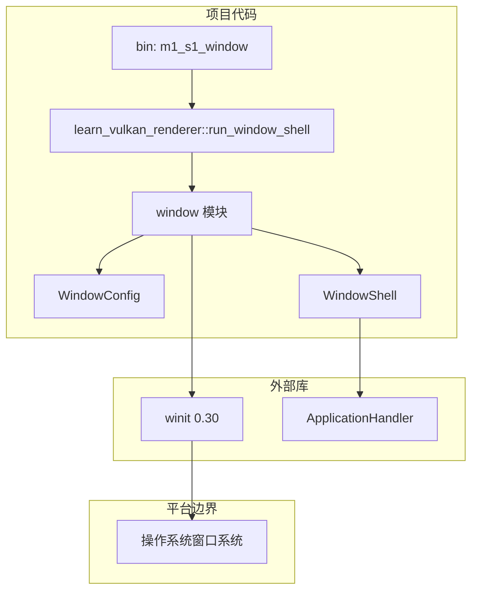

# M1-S1 桌面窗口壳分层

任务：M1-S1 选择窗口库并创建最小窗口。

## 分层说明

| 层级 | 当前职责 | 用到的库 |
| --- | --- | --- |
| binary | 提供 M1-S1 demo 启动入口 | 项目 crate |
| public API | 隐藏 `winit` 事件循环细节 | 项目 crate |
| window 模块 | 保存窗口配置、创建窗口、响应关闭事件 | `winit` |
| 平台层 | 创建并管理真实桌面窗口 | Windows/macOS/Linux 窗口系统，由 `winit` 适配 |

## 边界

- 本任务不创建 Vulkan surface。
- 本任务不创建 Vulkan instance、device、swapchain。
- `winit` 是平台窗口与事件循环库，不是 Vulkan 渲染库。

