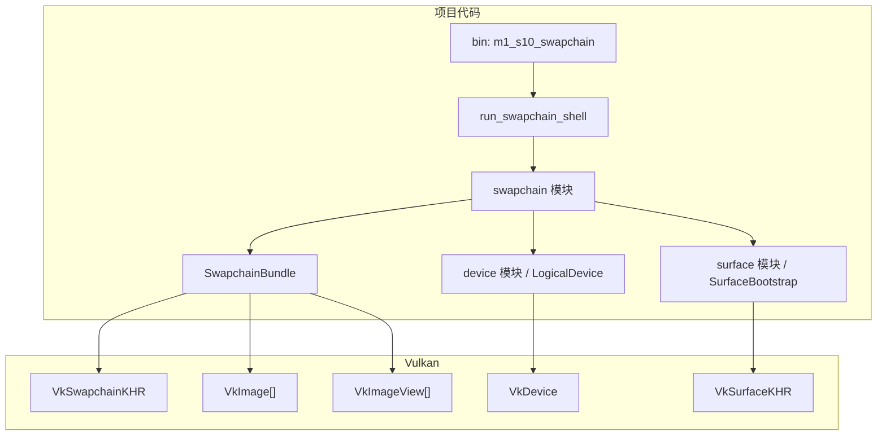

# M1-S10 Swapchain Image Views 分层

任务：M1-S10 创建 swapchain 和 image views。

## 分层说明

| 层级 | 当前职责 | 用到的库 |
| --- | --- | --- |
| swapchain 模块 | 创建 `VkSwapchainKHR`、获取 images、创建 image views | `ash` |
| device 模块 | 提供 logical device 和 queue family indices | `ash` |
| surface 模块 | 提供 `VkSurfaceKHR` 和 instance 上下文 | `ash-window` |

## 边界

- 本任务创建 swapchain 和 image views，但不录制命令。
- swapchain images 由 Vulkan swapchain 拥有，项目不销毁 image handle。
- image views 由项目创建，必须早于 swapchain 和 device 销毁。

