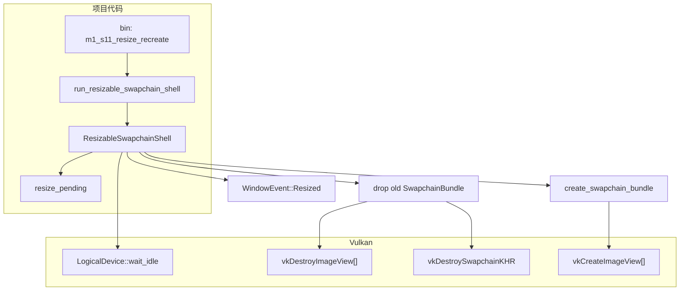

# M1-S11 Resize Swapchain Recreate 分层

任务：M1-S11 实现 resize 标记与 swapchain recreate。

## 分层说明

| 层级 | 当前职责 | 用到的库 |
| --- | --- | --- |
| swapchain 模块 | 处理 resize 事件，等待 device idle，替换 swapchain bundle | `ash`, `winit` |
| device 模块 | 提供 `LogicalDevice::wait_idle` 同步点 | `ash` |
| Vulkan 层 | 销毁旧 image views/swapchain 并创建新资源 | Vulkan driver |

## 边界

- 本任务采用保守重建：recreate 前等待 device idle。
- 窗口尺寸为 0 时不重建，避免创建非法 extent。
- 本任务还没有 acquire/submit/present 帧循环。

