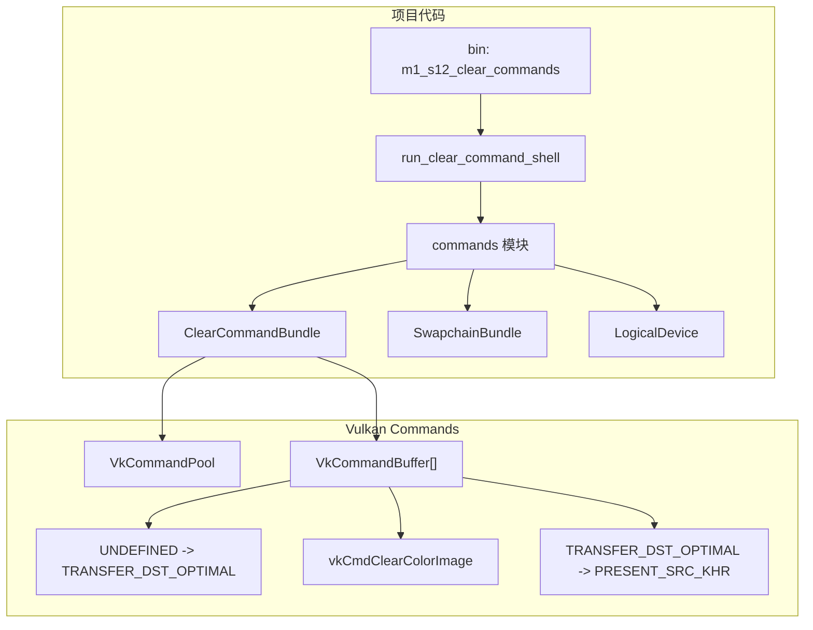

# M1-S12 Clear Command Recording 分层

任务：M1-S12 录制 clear swapchain image 的命令。

## 分层说明

| 层级 | 当前职责 | 用到的库 |
| --- | --- | --- |
| commands 模块 | 创建 command pool、分配 command buffers、录制 clear 命令 | `ash` |
| swapchain 模块 | 提供 swapchain images | `ash` |
| device 模块 | 提供 graphics queue family 和 logical device | `ash` |

## 边界

- 本任务只录制命令，不 acquire image，不 submit，不 present。
- 每个 swapchain image 对应一个 primary command buffer。
- 命令内容是 layout transition、clear color、transition 到 present layout。

