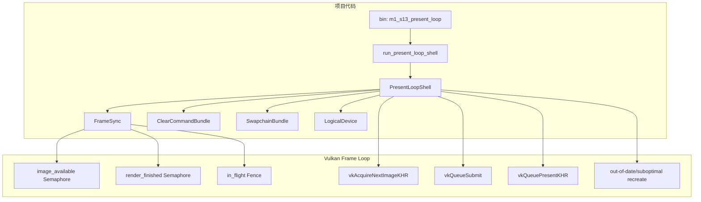

# M1-S13 Acquire Submit Present Loop 分层

任务：M1-S13 整合 acquire / submit / present 帧循环。

## 分层说明

| 层级 | 当前职责 | 用到的库 |
| --- | --- | --- |
| commands 模块 | 管理单帧同步对象并执行 acquire/submit/present | `ash` |
| swapchain 模块 | 提供 swapchain loader、swapchain handle 和 recreate 构造函数 | `ash` |
| winit shell | 通过 `RedrawRequested` 驱动帧循环 | `winit` |

## 边界

- 当前只使用单帧 in-flight 同步模型。
- out-of-date/suboptimal 或 resize 会保守地等待 device idle 并重建 swapchain/commands。
- 本任务完成清屏呈现闭环，但还没有 render pass、pipeline 或场景资源。

