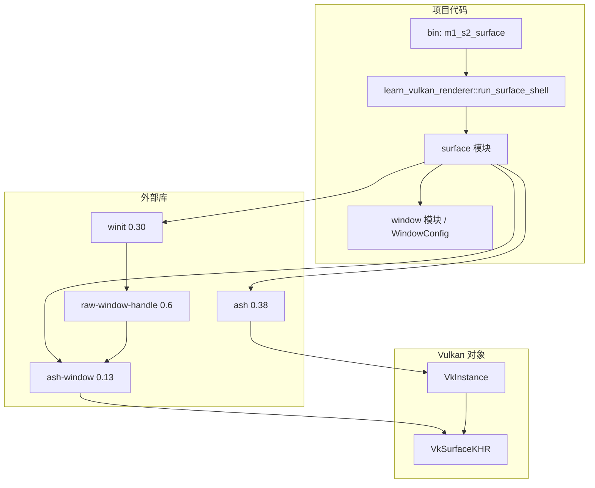

# M1-S2 Vulkan Surface 分层

任务：M1-S2 接入 raw window/display handle 并创建 Vulkan surface。

## 分层说明

| 层级 | 当前职责 | 用到的库 |
| --- | --- | --- |
| binary | 提供 M1-S2 surface 创建 demo | 项目 crate |
| surface 模块 | 从窗口获取 raw handle，创建最小 instance 与 surface | `ash`, `ash-window`, `winit` |
| window 模块 | 复用 M1-S1 的窗口配置 | `winit` |
| WSI 适配层 | 把 raw handle 映射到平台 surface 创建函数 | `ash-window`, `raw-window-handle` |
| Vulkan 层 | 创建 `VkInstance` 和 `VkSurfaceKHR` | Vulkan loader / driver |

## 边界

- 本任务只做 surface bootstrap。
- 本任务不创建 logical device、queue、swapchain。
- M1-S3 会把当前最小 instance 提升为正式 `VulkanInstance` 抽象。

