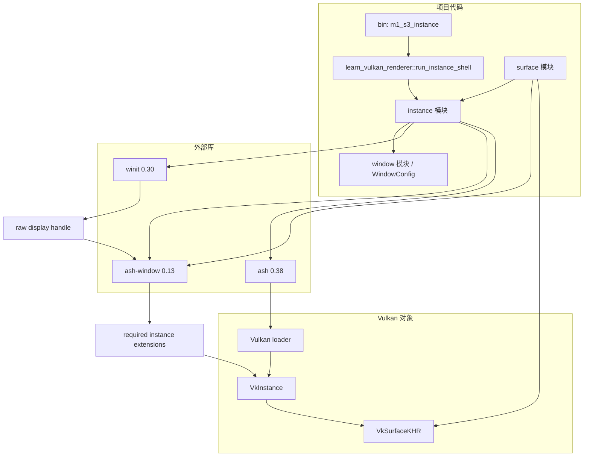

# M1-S3 Vulkan Instance 分层

任务：M1-S3 创建正式的 Vulkan entry 和 instance owner。

## 分层说明

| 层级 | 当前职责 | 用到的库 |
| --- | --- | --- |
| binary | 提供 M1-S3 instance 创建 demo | 项目 crate |
| instance 模块 | 持有 `Entry` 和 `VkInstance`，根据 display handle 启用必需扩展 | `ash`, `ash-window`, `winit` |
| surface 模块 | 复用 `VulkanInstance` 创建 `VkSurfaceKHR` | `ash`, `ash-window` |
| window 模块 | 复用窗口配置和 attributes 构造 | `winit` |
| Vulkan 层 | 提供 loader 函数表和 `VkInstance` 对象 | Vulkan loader / driver |

## 边界

- 本任务只创建 `Entry` 与 `VkInstance`。
- 本任务不启用 validation layer，不创建 debug messenger。
- 本任务不枚举 physical device，不创建 logical device 或 swapchain。
- `VkSurfaceKHR` 仍由 `SurfaceBootstrap` 管理，销毁顺序是 surface 先于 instance。

