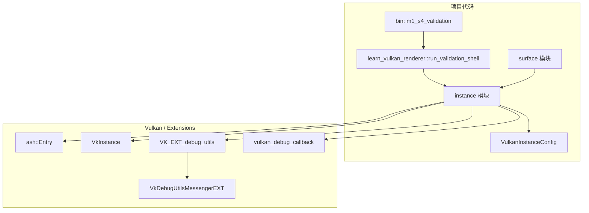

# M1-S4 Vulkan Validation Logging 分层

任务：M1-S4 开启 validation layer 和 debug messenger。

## 分层说明

| 层级 | 当前职责 | 用到的库 |
| --- | --- | --- |
| binary | 提供 M1-S4 validation logging demo | 项目 crate |
| instance 模块 | 检查 validation layer 和 debug utils extension，创建 debug messenger | `ash` |
| Vulkan extension | 提供 `VK_EXT_debug_utils` 回调和手动消息提交 | Vulkan loader / driver |
| surface 模块 | 继续复用 `VulkanInstance`，不直接管理 validation 资源 | `ash-window` |

## 边界

- validation 默认只在 debug build 中尝试启用。
- 如果机器没有 `VK_LAYER_KHRONOS_validation` 或 `VK_EXT_debug_utils`，程序降级继续运行。
- debug messenger 是 instance child object，必须先于 `VkInstance` 销毁。

