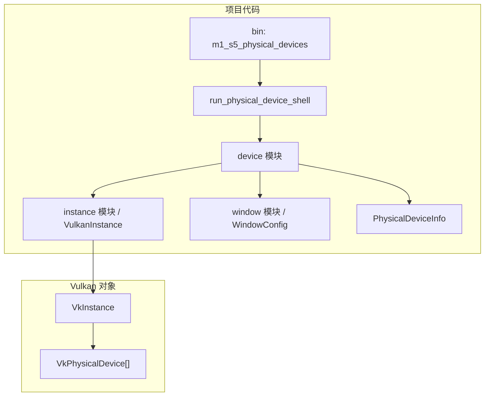

# M1-S5 Physical Device Enumeration 分层

任务：M1-S5 枚举 Vulkan physical devices 并打印 properties。

## 分层说明

| 层级 | 当前职责 | 用到的库 |
| --- | --- | --- |
| binary | 提供 M1-S5 GPU 枚举 demo | 项目 crate |
| device 模块 | 调用 `enumerate_physical_devices` 并读取 properties | `ash` |
| instance 模块 | 提供 live `VkInstance` 和 validation logging | `ash` |
| Vulkan 层 | 返回 physical device handles 与 properties | Vulkan driver |

## 边界

- 本任务只枚举和打印 GPU 信息。
- 本任务不选择最终设备，不检查 queue family，不创建 logical device。
- `vk::PhysicalDevice` 是 borrowed handle，不由项目代码销毁。

