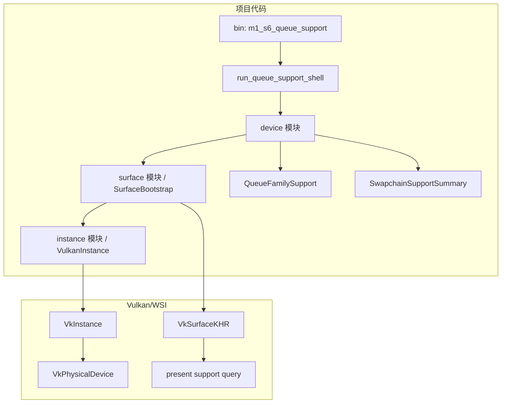

# M1-S6 Queue And Swapchain Support 分层

任务：M1-S6 查询 queue family 和 swapchain 支持。

## 分层说明

| 层级 | 当前职责 | 用到的库 |
| --- | --- | --- |
| device 模块 | 查询 queue family properties、present support、swapchain support 数量 | `ash` |
| surface 模块 | 暴露 `VulkanInstance`、`SurfaceLoader` 和 `VkSurfaceKHR` 的只读访问 | `ash-window` |
| Vulkan WSI | 根据 physical device 与 surface 判断 present 支持 | `VK_KHR_surface` |

## 边界

- 本任务只判断是否存在 graphics/present queue family。
- swapchain 支持当前只记录 capabilities、format 数量和 present mode 数量。
- 本任务不选择最终 physical device，也不创建 logical device。

