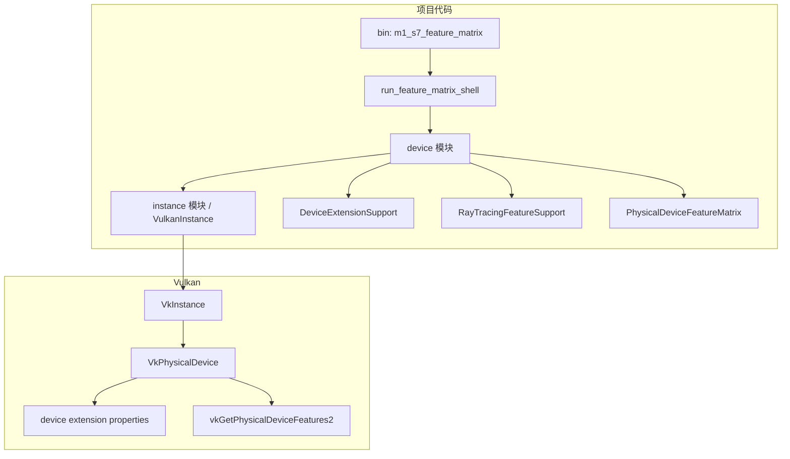

# M1-S7 Device Extension And Feature Matrix 分层

任务：M1-S7 检查 device extension 和光追 feature。

## 分层说明

| 层级 | 当前职责 | 用到的库 |
| --- | --- | --- |
| device 模块 | 查询 device extensions 和 feature2 pNext 链 | `ash` |
| feature matrix | 记录 swapchain 必需扩展和光追扩展/feature 支持 | 项目结构 |
| Vulkan 层 | 返回扩展列表和 feature bits | Vulkan driver |

## 边界

- 本任务只记录支持矩阵，不启用任何 device feature。
- swapchain extension 是后续 logical device 的必需项。
- 光追相关扩展和 feature 只报告，不作为模块一的强制条件。

