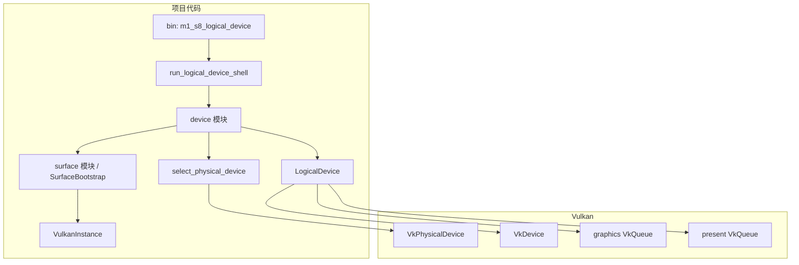

# M1-S8 Logical Device And Queues 分层

任务：M1-S8 创建 logical device 并获取 graphics/present queue。

## 分层说明

| 层级 | 当前职责 | 用到的库 |
| --- | --- | --- |
| device 模块 | 选择 surface-capable GPU，创建 logical device 并获取队列 | `ash` |
| surface 模块 | 提供 instance/surface 查询上下文 | `ash-window` |
| Vulkan 层 | 创建 `VkDevice`，返回 `VkQueue` handles | Vulkan driver |

## 边界

- 本任务只启用 `VK_KHR_swapchain` device extension。
- 本任务不创建 swapchain，不分配 image views，不录制 command buffer。
- `LogicalDevice` 是 `VkDevice` 的 RAII owner，后续 device child object 必须早于它销毁。

