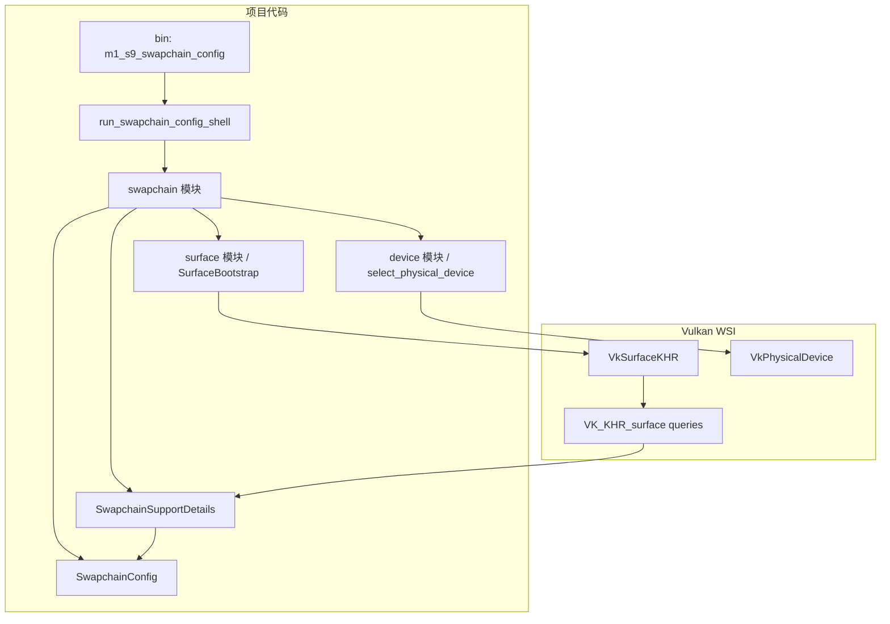

# M1-S9 Swapchain Configuration 分层

任务：M1-S9 选择 surface format、present mode、extent 和 image count。

## 分层说明

| 层级 | 当前职责 | 用到的库 |
| --- | --- | --- |
| swapchain 模块 | 查询详细 support 并选择 format/present/extent/image count | `ash`, `winit` |
| device 模块 | 选择满足 queue 和 swapchain extension 的 physical device | `ash` |
| surface 模块 | 提供 surface 和 instance 上下文 | `ash-window` |

## 边界

- 本任务只选择 swapchain 参数，不创建 `VkSwapchainKHR`。
- present mode 优先 `MAILBOX`，否则使用 Vulkan 保证支持的 `FIFO`。
- extent 在 surface 指定固定尺寸时尊重 surface，否则按窗口大小 clamp。

