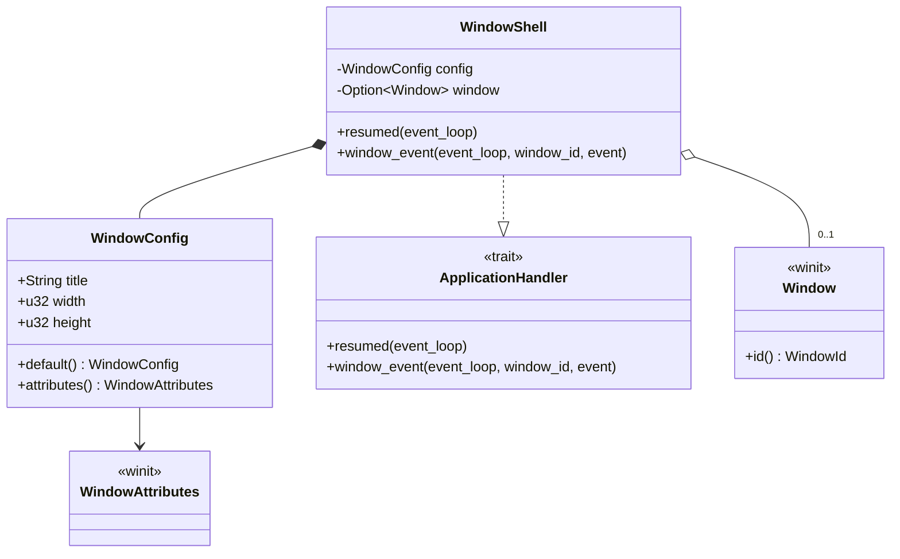

# M1-S1 桌面窗口壳类图

## 类型说明

| 类型 | 来源 | 职责 |
| --- | --- | --- |
| `WindowConfig` | 项目代码 | 保存窗口标题和逻辑尺寸 |
| `WindowShell` | 项目代码 | 保存应用运行期状态，并实现 `ApplicationHandler` |
| `ApplicationHandler` | `winit` | 事件驱动应用生命周期接口 |
| `Window` | `winit` | 原生窗口对象的跨平台封装 |
| `WindowAttributes` | `winit` | 窗口创建参数 |

## 经典设计模式

| 模式 | 位置 | 说明 |
| --- | --- | --- |
| Builder | `Window::default_attributes().with_title(...).with_inner_size(...)` | 使用链式方法构造 `WindowAttributes` |
| Facade | `run_window_shell` | 对 binary 隐藏 `EventLoop`、`WindowShell` 和 `ApplicationHandler` 细节 |
| Template Method | `ApplicationHandler` 回调 | `winit` 控制事件循环主流程，项目代码实现生命周期钩子 |

## Rust 惯用法

- `Option<Window>` 表达窗口是否已经创建。
- `Result<(), EventLoopError>` 保留事件循环创建和运行失败路径。
- `WindowShell` 长期持有 `Window`，避免窗口对象提前 drop。

