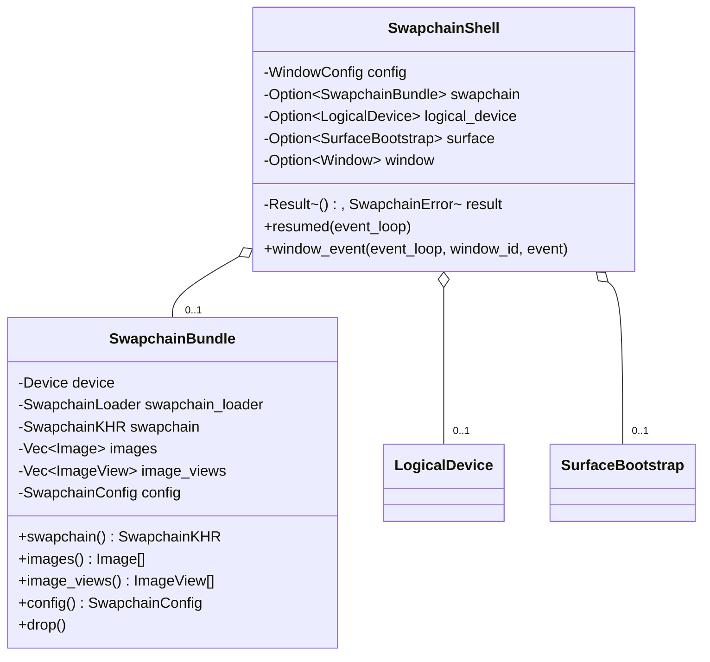

# M1-S10 Swapchain Image Views 类图

## 类型说明

| 类型 | 来源 | 职责 |
| --- | --- | --- |
| `SwapchainBundle` | 项目代码 | 拥有 swapchain loader、`VkSwapchainKHR` 和 image views |
| `SwapchainShell` | 项目代码 | 演示 surface、logical device、swapchain 和 image view 创建顺序 |

## 经典设计模式

| 模式 | 位置 | 说明 |
| --- | --- | --- |
| Factory Method | `create_swapchain_bundle` | 根据 surface/device/config 创建完整 swapchain bundle |
| Facade | `run_swapchain_shell` | 对 demo 隐藏设备选择、logical device、swapchain 和 image view 创建 |

## Rust 惯用法

- `SwapchainBundle` 使用 RAII 销毁 image views 和 swapchain。
- shell 字段顺序保证 swapchain 先于 logical device 和 surface drop。
- `AshDevice` clone 只保存函数表和 handle，用于 bundle drop 中销毁 image views。

