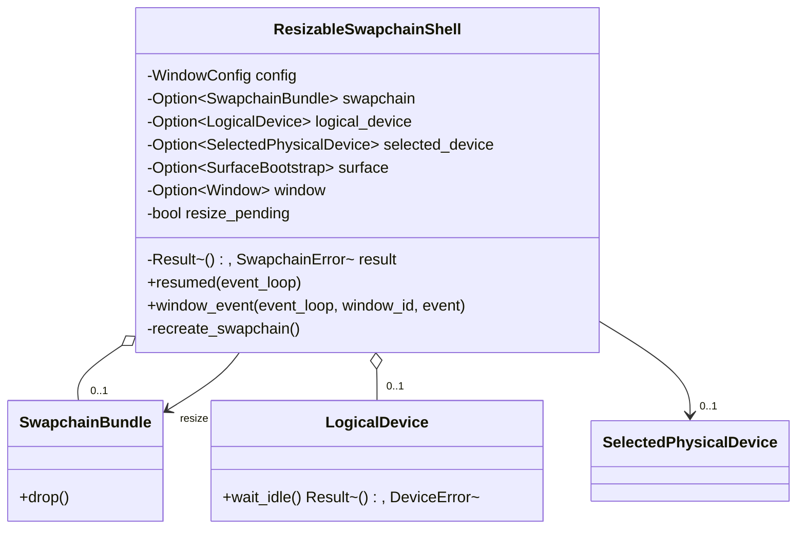

# M1-S11 Resize Swapchain Recreate 类图

## 类型说明

| 类型 | 来源 | 职责 |
| --- | --- | --- |
| `ResizableSwapchainShell` | 项目代码 | 响应 resize，保留选择结果并替换 swapchain bundle |
| `LogicalDevice::wait_idle` | 项目代码 | 为保守重建提供 GPU 同步点 |
| `SwapchainBundle` | 项目代码 | 在替换时自动销毁旧 image views 和 swapchain |

## 经典设计模式

| 模式 | 位置 | 说明 |
| --- | --- | --- |
| State | `resize_pending` | 记录窗口尺寸变化导致 swapchain 失效 |
| Facade | `run_resizable_swapchain_shell` | 对 demo 隐藏 resize 事件、同步和资源替换 |

## Rust 惯用法

- 用 `Option::None` 触发旧 `SwapchainBundle` 的 RAII drop。
- 重建前借用现有 surface/device/selected device，不重新选择 GPU。
- 退出时按 swapchain、device、surface 的顺序清空。

