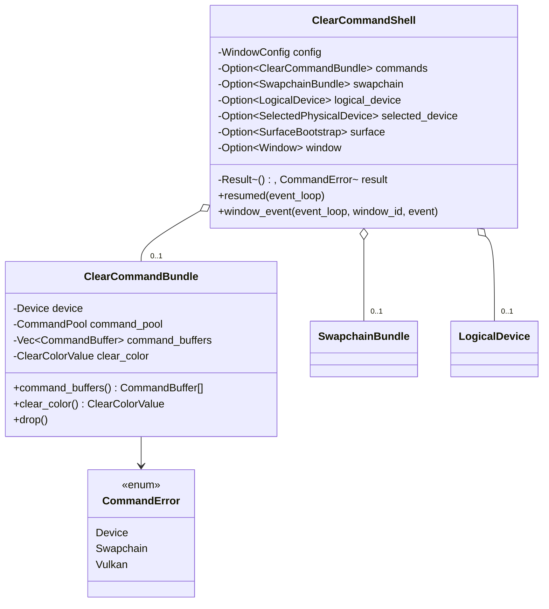

# M1-S12 Clear Command Recording 类图

## 类型说明

| 类型 | 来源 | 职责 |
| --- | --- | --- |
| `ClearCommandBundle` | 项目代码 | 拥有 command pool 和 clear command buffers |
| `CommandError` | 项目代码 | 汇总 device、swapchain 和 Vulkan command 错误 |
| `ClearCommandShell` | 项目代码 | 演示从 swapchain 到 clear command recording 的完整准备路径 |

## 经典设计模式

| 模式 | 位置 | 说明 |
| --- | --- | --- |
| Command | `ClearCommandBundle` | 把将来提交给 GPU 的 clear 操作封装成 command buffer 集合 |
| Factory Method | `create_clear_command_bundle` | 根据 logical device 和 swapchain 创建并录制 command buffers |

## Rust 惯用法

- command pool 的 RAII drop 会释放 command buffers。
- command buffers 借用 swapchain images 录制，不拥有 image。
- `CommandError` 与前面阶段错误分层，便于后续帧循环传播。

