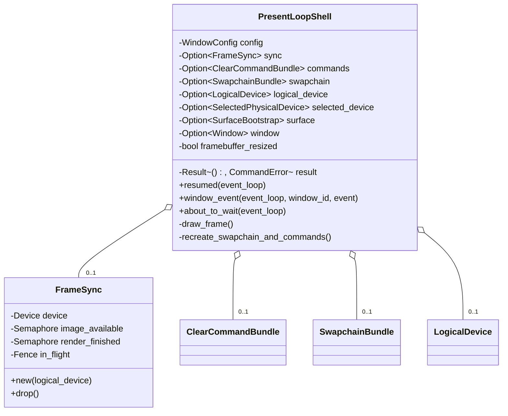

# M1-S13 Acquire Submit Present Loop 类图

## 类型说明

| 类型 | 来源 | 职责 |
| --- | --- | --- |
| `FrameSync` | 项目代码 | 拥有 image-available/render-finished semaphores 和 in-flight fence |
| `PresentLoopShell` | 项目代码 | 响应 redraw/resize，调用 acquire/submit/present 并重建资源 |
| `draw_clear_frame` | 项目代码 | 执行单帧同步和呈现流程 |

## 经典设计模式

| 模式 | 位置 | 说明 |
| --- | --- | --- |
| Observer | `WindowEvent::RedrawRequested` | winit 通知应用绘制时机 |
| State | `framebuffer_resized` | 记录 swapchain 已失效，需要重建 |
| Facade | `run_present_loop_shell` | 封装完整清屏呈现 demo |

## Rust 惯用法

- 同步对象用 RAII 管理，退出前显式 `device_wait_idle`。
- acquire/submit/present 返回 `bool` 表达是否需要重建。
- `Option` 清空顺序保证 commands/swapchain 早于 device/surface 释放。

