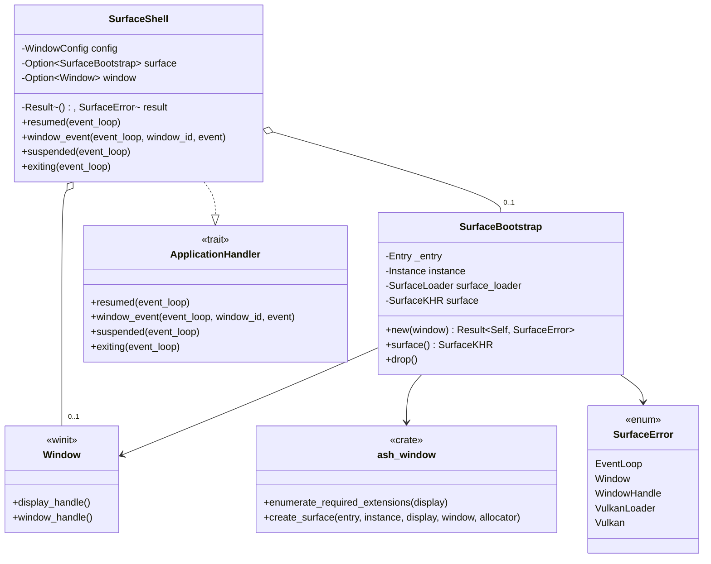

# M1-S2 Vulkan Surface 类图

## 类型说明

| 类型 | 来源 | 职责 |
| --- | --- | --- |
| `SurfaceShell` | 项目代码 | 在 winit 生命周期中创建/销毁窗口 surface |
| `SurfaceBootstrap` | 项目代码 | 持有最小 `Entry`、`Instance`、surface loader 和 `SurfaceKHR` |
| `SurfaceError` | 项目代码 | 汇总 winit、raw handle、Vulkan loader 和 Vulkan API 错误 |
| `Window` | `winit` | 提供 raw display/window handle |
| `ash_window` | `ash-window` | 根据 raw handle 创建平台相关 `VkSurfaceKHR` |

## 经典设计模式

| 模式 | 位置 | 说明 |
| --- | --- | --- |
| Facade | `run_surface_shell` | 对 demo binary 隐藏事件循环、窗口、instance 和 surface 创建细节 |
| Template Method | `ApplicationHandler` 回调 | `winit` 控制生命周期，项目代码填入 `resumed/suspended/exiting` |
| Factory Method | `ash_window::create_surface` | 根据 raw handle 类型分派到平台 surface 创建路径 |

## Rust 惯用法

- `Drop` 保证先销毁 `VkSurfaceKHR`，再销毁 `VkInstance`。
- `_entry` 字段显式保留 Vulkan loader 上下文生命周期。
- `SurfaceError` 用 `From` 实现把多个底层错误统一到任务边界。
- `Option<SurfaceBootstrap>` 表达 surface 可能因 suspend/exiting 被释放。

