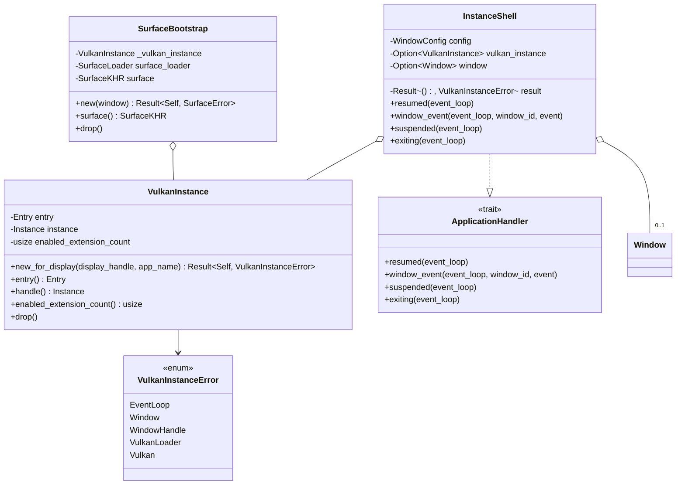

# M1-S3 Vulkan Instance 类图

## 类型说明

| 类型 | 来源 | 职责 |
| --- | --- | --- |
| `VulkanInstance` | 项目代码 | 拥有 `Entry` 和 `VkInstance`，并在 `Drop` 中销毁 instance |
| `InstanceShell` | 项目代码 | 在 winit 生命周期中创建窗口和 instance，用于 M1-S3 demo |
| `VulkanInstanceError` | 项目代码 | 汇总窗口、raw display handle、Vulkan loader 和 Vulkan API 错误 |
| `SurfaceBootstrap` | 项目代码 | 复用 `VulkanInstance`，只保留 surface 所有权 |

## 经典设计模式

| 模式 | 位置 | 说明 |
| --- | --- | --- |
| Facade | `run_instance_shell` | 对 demo binary 隐藏事件循环、窗口和 Vulkan instance 创建细节 |
| Template Method | `ApplicationHandler` 回调 | `winit` 定义生命周期骨架，项目代码填入资源创建和退出行为 |
| Factory Method | `VulkanInstance::new_for_display` | 根据 display handle 计算扩展并创建配置好的 `VkInstance` |

## Rust 惯用法

- `VulkanInstance` 使用 RAII 管理 `VkInstance` 生命周期。
- `SurfaceBootstrap` 通过字段持有 `_vulkan_instance`，保证 surface 创建后 instance 不会提前释放。
- `VulkanInstanceError` 用 `From` 串接底层错误，让 `?` 可以穿透窗口和 Vulkan 初始化路径。

