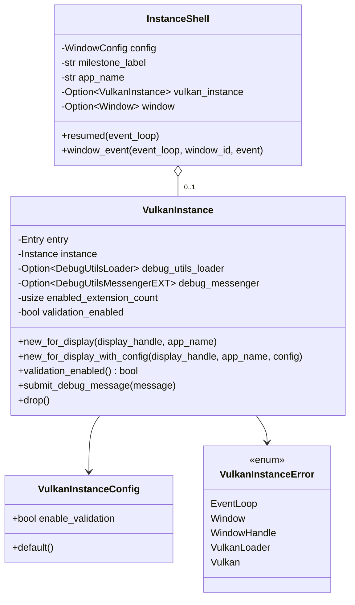

# M1-S4 Vulkan Validation Logging 类图

## 类型说明

| 类型 | 来源 | 职责 |
| --- | --- | --- |
| `VulkanInstanceConfig` | 项目代码 | 控制是否尝试启用 validation layer |
| `VulkanInstance` | 项目代码 | 持有 `Entry`、`VkInstance`、debug utils loader 和 messenger |
| `InstanceShell` | 项目代码 | 复用 M1-S3 窗口生命周期，提供 M1-S4 demo 标签 |

## 经典设计模式

| 模式 | 位置 | 说明 |
| --- | --- | --- |
| Facade | `run_validation_shell` | 隐藏 validation layer 检查、instance 创建和 debug messenger 生命周期 |
| Strategy | `VulkanInstanceConfig` | 用配置选择是否启用 validation 行为 |
| Template Method | `ApplicationHandler` 回调 | `winit` 控制生命周期，项目代码填入 instance/debug 创建与退出 |

## Rust 惯用法

- `Option<DebugUtilsMessengerEXT>` 表达 debug messenger 可能因为环境缺失而不存在。
- `Drop` 保证 messenger 先于 instance 销毁。
- debug callback 是 `unsafe extern "system"` 函数，符合 Vulkan C ABI。

