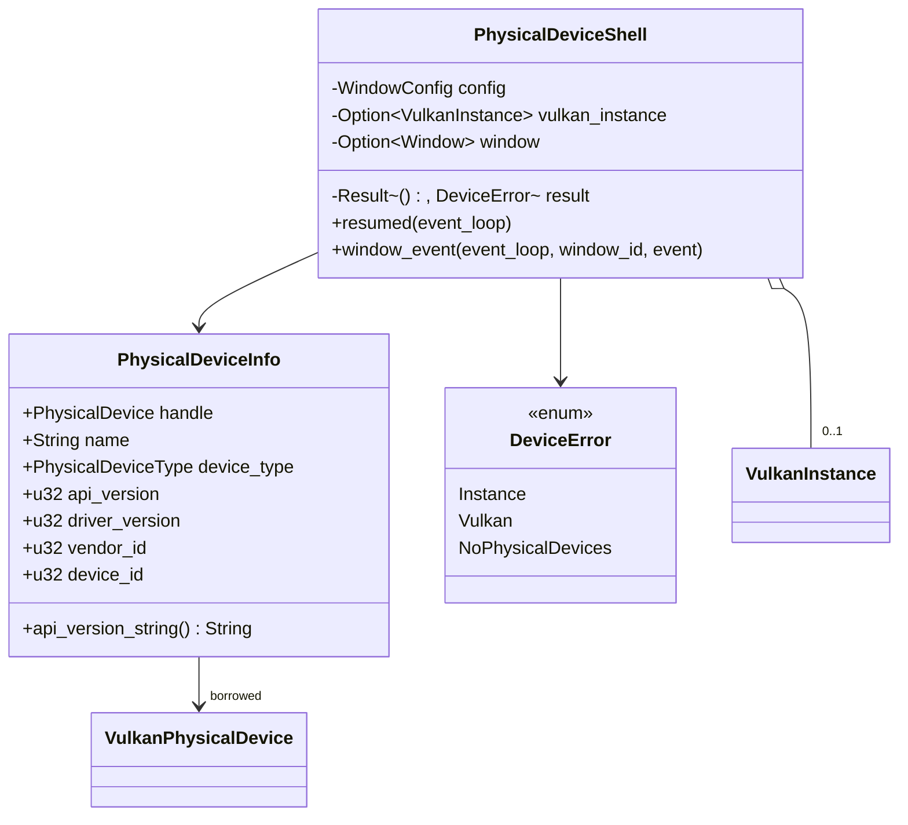

# M1-S5 Physical Device Enumeration 类图

## 类型说明

| 类型 | 来源 | 职责 |
| --- | --- | --- |
| `PhysicalDeviceInfo` | 项目代码 | 保存一个 GPU 的 handle 和可读 properties |
| `DeviceError` | 项目代码 | 汇总 instance、Vulkan API 与无设备错误 |
| `PhysicalDeviceShell` | 项目代码 | 在 winit 生命周期里创建 instance 并打印设备列表 |

## 经典设计模式

| 模式 | 位置 | 说明 |
| --- | --- | --- |
| Facade | `run_physical_device_shell` | 隐藏窗口、instance、GPU 枚举和错误处理细节 |
| Adapter | `PhysicalDeviceInfo::from_properties` | 把 C 风格 `VkPhysicalDeviceProperties` 适配成 Rust 可读结构 |

## Rust 惯用法

- `PhysicalDeviceInfo` 保存 `vk::PhysicalDevice` handle，但不拥有 GPU 资源。
- C 字符串 `device_name` 通过 `CStr` 安全转换成 `String`。
- `DeviceError` 通过 `From` 支持 `?` 从 Vulkan API 错误自然传播。

