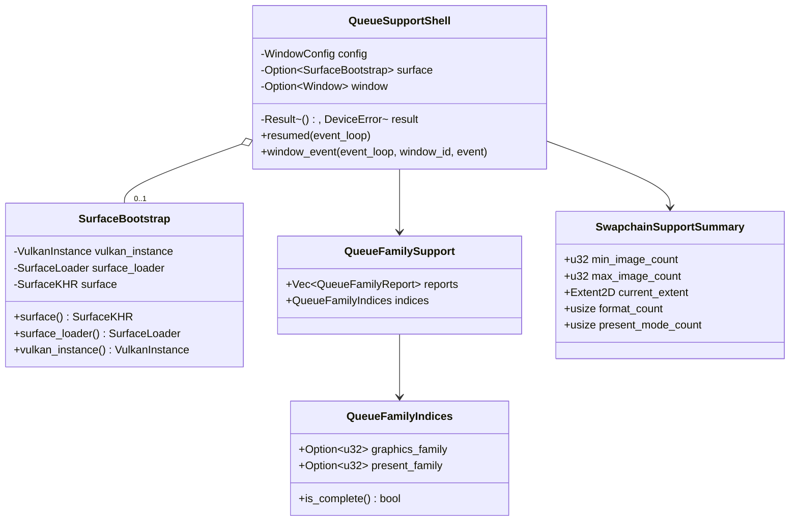

# M1-S6 Queue And Swapchain Support 类图

## 类型说明

| 类型 | 来源 | 职责 |
| --- | --- | --- |
| `QueueFamilyIndices` | 项目代码 | 保存 graphics/present queue family index |
| `QueueFamilySupport` | 项目代码 | 保存每个 queue family 的 flags、queue_count 和 present 支持 |
| `SwapchainSupportSummary` | 项目代码 | 保存 swapchain capabilities 的最小可用摘要 |
| `QueueSupportShell` | 项目代码 | 创建 surface 后对所有 GPU 打印 queue/swapchain 支持 |

## 经典设计模式

| 模式 | 位置 | 说明 |
| --- | --- | --- |
| Facade | `run_queue_support_shell` | 对 demo 隐藏 surface、GPU 枚举和 WSI 支持查询细节 |
| Adapter | `QueueFamilySupport` | 把 Vulkan 队列族属性与 WSI present 查询合并成项目结构 |

## Rust 惯用法

- `SurfaceBootstrap` 继续拥有 surface，device 模块只借用它查询。
- `QueueFamilyIndices::is_complete` 把后续设备选择的判定封装成小而明确的谓词。
- `DeviceError::NoSuitableQueueFamilies` 提供可读失败路径。

