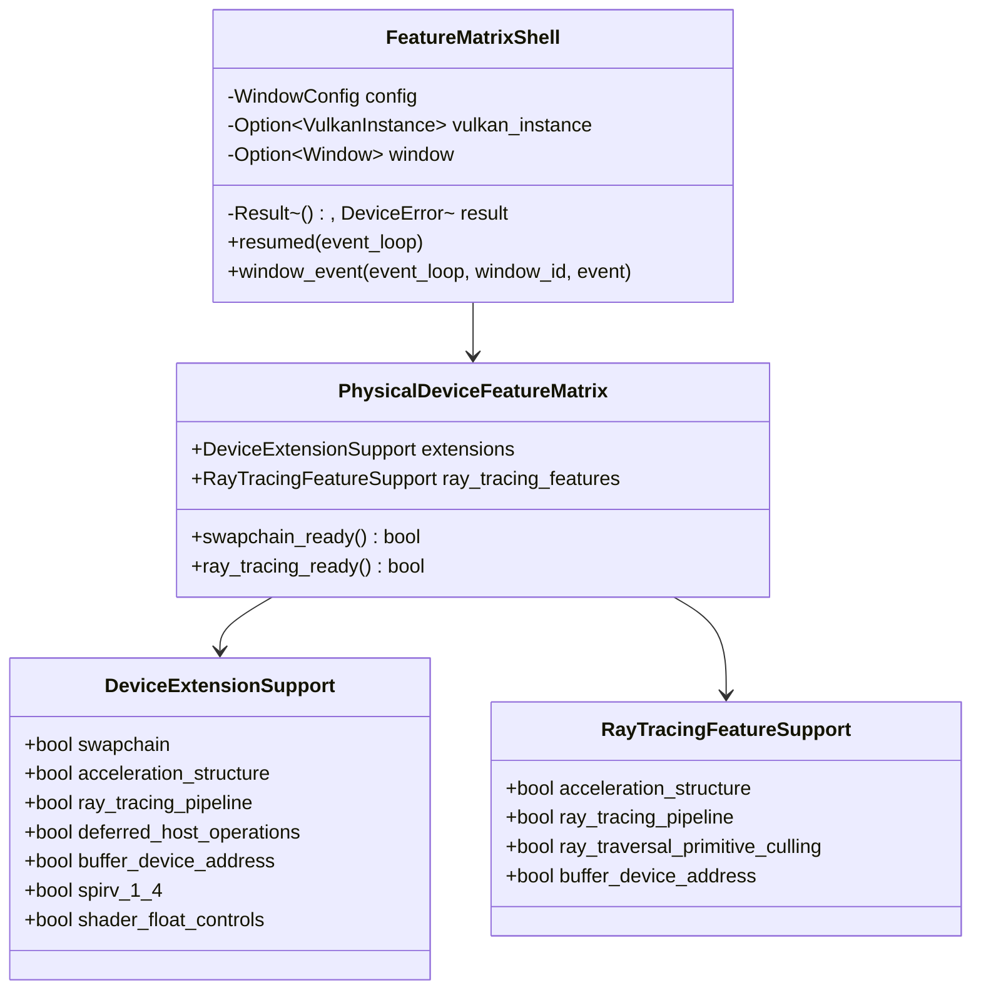

# M1-S7 Device Extension And Feature Matrix 类图

## 类型说明

| 类型 | 来源 | 职责 |
| --- | --- | --- |
| `DeviceExtensionSupport` | 项目代码 | 保存必需和可选 device extension 支持 |
| `RayTracingFeatureSupport` | 项目代码 | 保存光追核心 feature bits |
| `PhysicalDeviceFeatureMatrix` | 项目代码 | 合并 extension 与 feature，提供 readiness 谓词 |

## 经典设计模式

| 模式 | 位置 | 说明 |
| --- | --- | --- |
| Facade | `run_feature_matrix_shell` | 隐藏窗口、instance、设备枚举和 feature 查询细节 |
| Adapter | `PhysicalDeviceFeatureMatrix` | 把 Vulkan C feature structs 适配为项目可读支持矩阵 |

## Rust 惯用法

- feature pNext 链使用栈上结构体，调用结束后读取 Bool32 结果。
- readiness 方法把后续选择策略从打印逻辑中分离出来。
- 光追支持保持可选，避免模块一强制要求高端 GPU。

