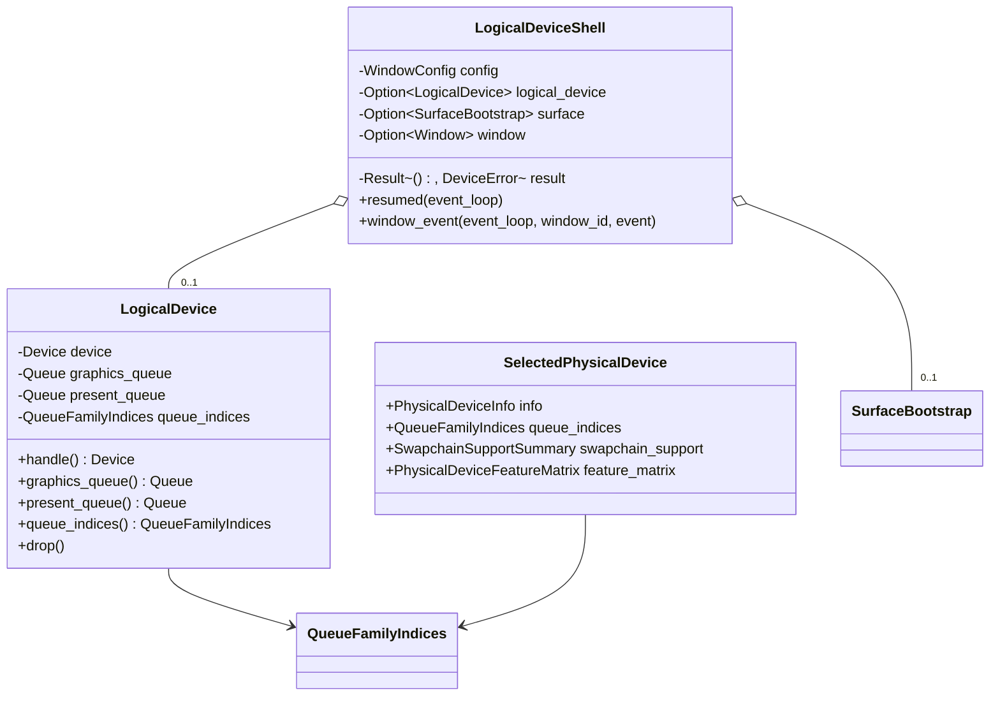

# M1-S8 Logical Device And Queues 类图

## 类型说明

| 类型 | 来源 | 职责 |
| --- | --- | --- |
| `SelectedPhysicalDevice` | 项目代码 | 保存通过 queue/swapchain/device-extension 检查的 GPU |
| `LogicalDevice` | 项目代码 | 拥有 `VkDevice`，缓存 graphics/present queue handles |
| `LogicalDeviceShell` | 项目代码 | 演示 surface、GPU 选择和 logical device 创建顺序 |

## 经典设计模式

| 模式 | 位置 | 说明 |
| --- | --- | --- |
| Factory Method | `create_logical_device` | 根据已选择的 physical device 和 queue indices 构造 `VkDevice` |
| Strategy | `select_physical_device` | 封装当前设备选择策略，后续可以替换评分逻辑 |
| Facade | `run_logical_device_shell` | 对 demo 隐藏 surface、选择和 logical device 创建细节 |

## Rust 惯用法

- `LogicalDevice` 使用 RAII 管理 `vkDestroyDevice`。
- `LogicalDeviceShell` 字段顺序和 `exiting` 逻辑保证 logical device 早于 surface/instance 释放。
- queue handles 是 borrowed Vulkan handles，不单独销毁。

