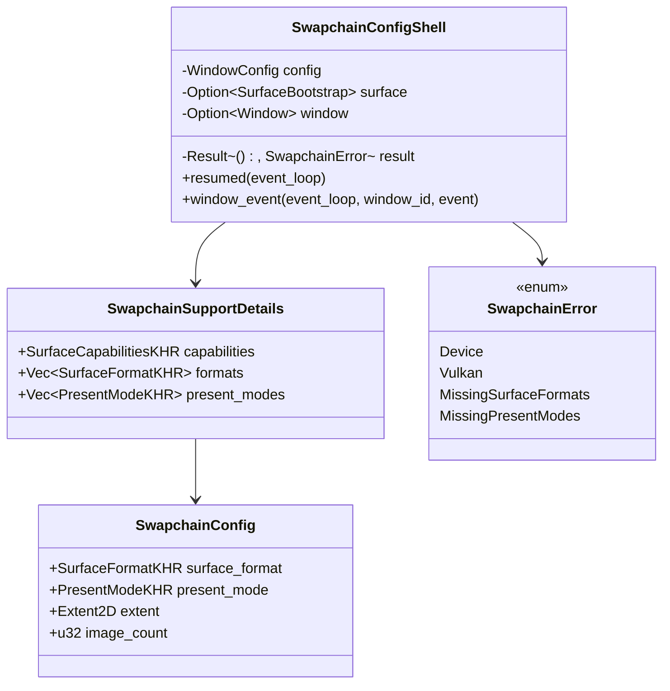

# M1-S9 Swapchain Configuration 类图

## 类型说明

| 类型 | 来源 | 职责 |
| --- | --- | --- |
| `SwapchainSupportDetails` | 项目代码 | 保存 surface capabilities、formats 和 present modes |
| `SwapchainConfig` | 项目代码 | 保存最终选择的 swapchain 创建参数 |
| `SwapchainError` | 项目代码 | 汇总 device/Vulkan/缺少支持项错误 |

## 经典设计模式

| 模式 | 位置 | 说明 |
| --- | --- | --- |
| Strategy | `choose_swapchain_config` | 封装 format/present/extent/image count 选择策略 |
| Facade | `run_swapchain_config_shell` | 对 demo 隐藏 surface、设备选择和参数选择细节 |

## Rust 惯用法

- support details 和 config 分离，避免把“原始能力查询”和“策略选择”耦合。
- `SwapchainError` 独立于 `DeviceError`，给 swapchain 阶段保留专属错误语义。
- 选择函数只借用输入，返回 copy-friendly Vulkan value structs。

