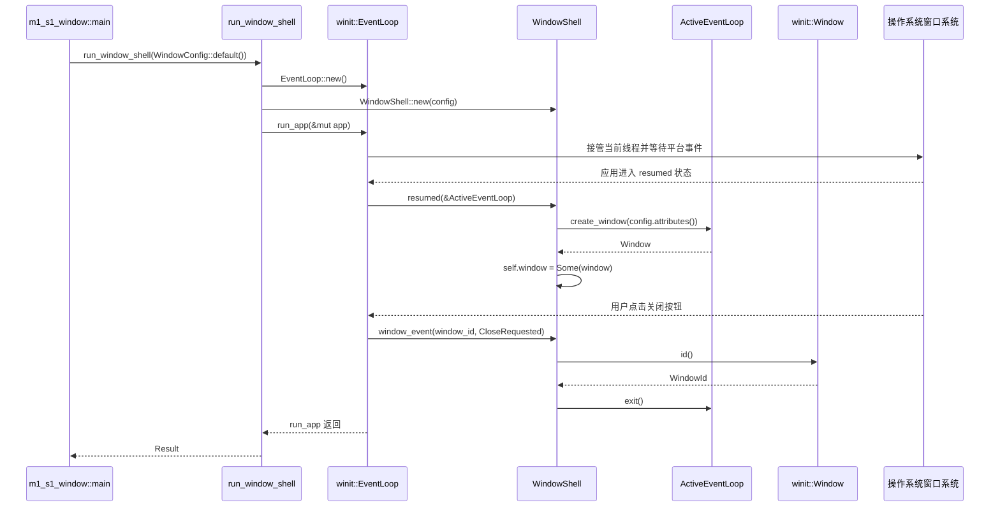

# M1-S1 桌面窗口壳时序图

```mermaid
sequenceDiagram
    participant Main as m1_s1_window::main
    participant Api as run_window_shell
    participant EventLoop as winit::EventLoop
    participant App as WindowShell
    participant Active as ActiveEventLoop
    participant Window as winit::Window
    participant OS as 操作系统窗口系统

    Main->>Api: run_window_shell(WindowConfig::default())
    Api->>EventLoop: EventLoop::new()
    Api->>App: WindowShell::new(config)
    Api->>EventLoop: run_app(&mut app)
    EventLoop->>OS: 接管当前线程并等待平台事件
    OS-->>EventLoop: 应用进入 resumed 状态
    EventLoop->>App: resumed(&ActiveEventLoop)
    App->>Active: create_window(config.attributes())
    Active-->>App: Window
    App->>App: self.window = Some(window)
    OS-->>EventLoop: 用户点击关闭按钮
    EventLoop->>App: window_event(window_id, CloseRequested)
    App->>Window: id()
    Window-->>App: WindowId
    App->>Active: exit()
    EventLoop-->>Api: run_app 返回
    Api-->>Main: Result
```

## 关键顺序

1. `run_app` 接管当前线程。
2. `winit` 在 `resumed` 回调中允许创建窗口。
3. `WindowShell` 保存 `Window`，保证窗口生命周期覆盖事件循环。
4. 收到 `CloseRequested` 后调用 `event_loop.exit()` 请求退出。

