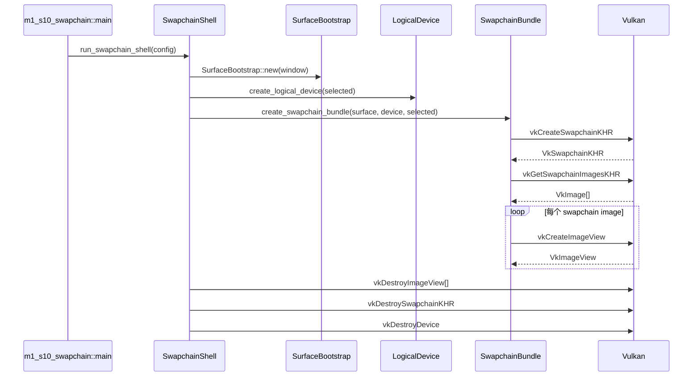

# M1-S10 Swapchain Image Views 时序图

## 关键顺序

1. swapchain 创建需要 surface、logical device、queue family indices 和 S9 配置。
2. swapchain images 由 swapchain 拥有；项目只为它们创建 image views。
3. 销毁时 image views 先于 swapchain，swapchain 先于 logical device。

