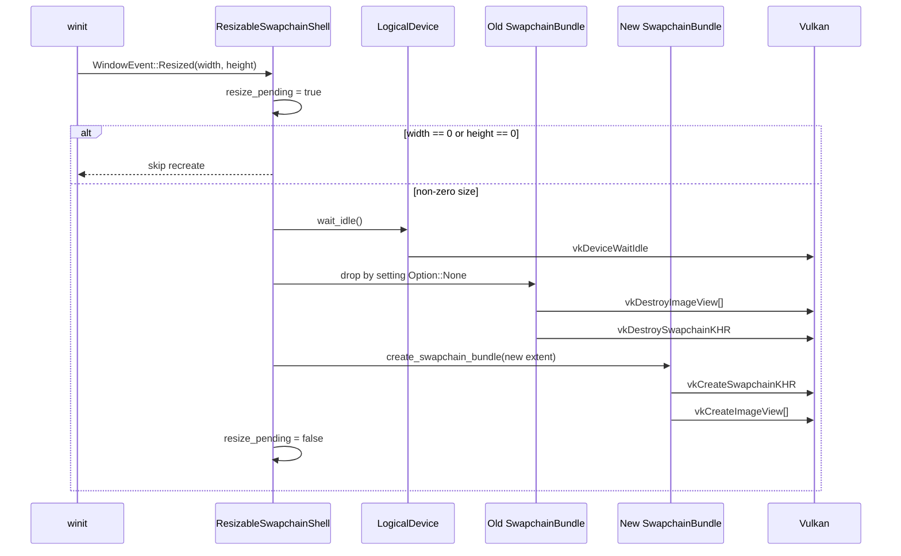

# M1-S11 Resize Swapchain Recreate 时序图

```mermaid
sequenceDiagram
    participant Winit as winit
    participant Shell as ResizableSwapchainShell
    participant Device as LogicalDevice
    participant Old as Old SwapchainBundle
    participant New as New SwapchainBundle
    participant Vulkan as Vulkan

    Winit->>Shell: WindowEvent::Resized(width, height)
    Shell->>Shell: resize_pending = true
    alt width == 0 or height == 0
        Shell-->>Winit: skip recreate
    else non-zero size
        Shell->>Device: wait_idle()
        Device->>Vulkan: vkDeviceWaitIdle
        Shell->>Old: drop by setting Option::None
        Old->>Vulkan: vkDestroyImageView[]
        Old->>Vulkan: vkDestroySwapchainKHR
        Shell->>New: create_swapchain_bundle(new extent)
        New->>Vulkan: vkCreateSwapchainKHR
        New->>Vulkan: vkCreateImageView[]
        Shell->>Shell: resize_pending = false
    end
```

## 关键顺序

1. 先等待 device idle，确保旧 swapchain 不再被 GPU 使用。
2. 旧 image views 先于旧 swapchain 销毁。
3. 零尺寸窗口暂缓重建，等待下一次非零 resize。

