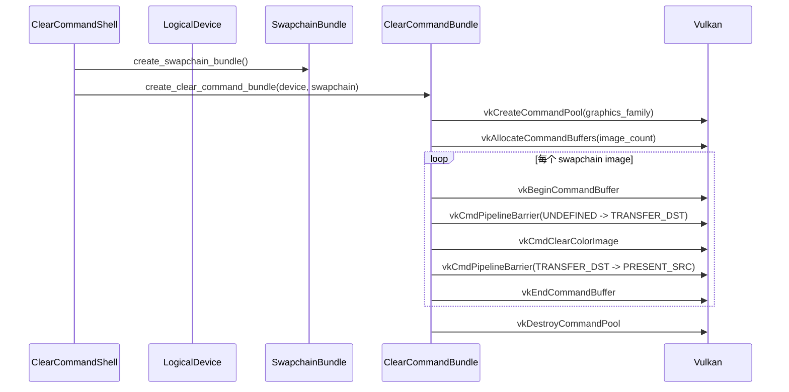

# M1-S12 Clear Command Recording 时序图

## 关键顺序

1. command pool 必须绑定 graphics queue family。
2. clear 前先把 swapchain image 转到 `TRANSFER_DST_OPTIMAL`。
3. clear 后转到 `PRESENT_SRC_KHR`，为 S13 present 做准备。

