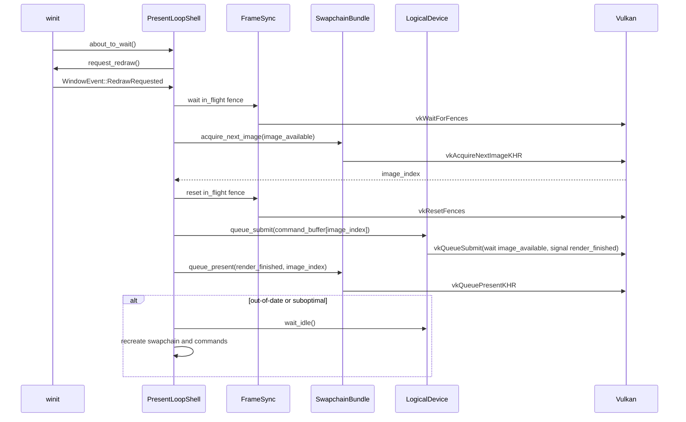

# M1-S13 Acquire Submit Present Loop 时序图

## 关键顺序

1. acquire 等待 image-available semaphore。
2. submit 等待 image-available，执行对应 image 的 command buffer，并 signal render-finished。
3. present 等待 render-finished。
4. resize/out-of-date 触发 swapchain 与 command buffers 一起重建。

