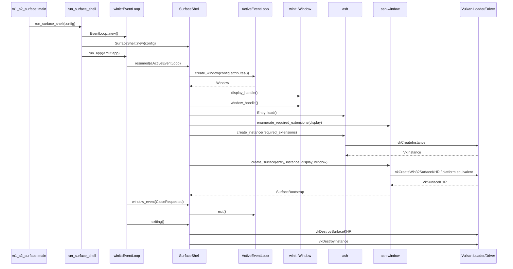

# M1-S2 Vulkan Surface 时序图

## 关键顺序

1. 必须先通过 display handle 查询 surface 所需 instance extensions。
2. 必须启用这些 extensions 后创建 `VkInstance`。
3. 必须用同一个 live window/display handle 创建 `VkSurfaceKHR`。
4. 退出时必须先销毁 surface，再销毁 instance。

