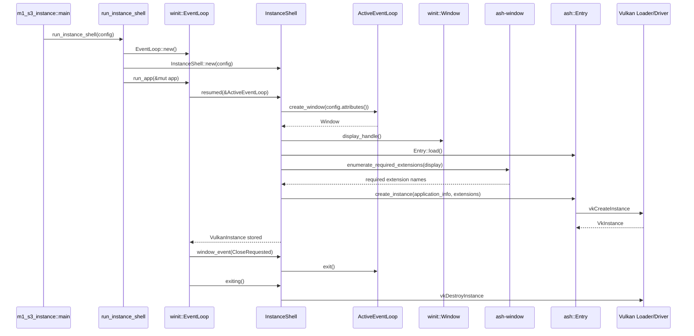

# M1-S3 Vulkan Instance 时序图

## 关键顺序

1. `Entry` 必须先从平台 Vulkan loader 加载。
2. `VkInstance` 创建前必须根据 display handle 启用 surface 相关 instance extensions。
3. `VulkanInstance` 持有 `Entry` 和 `Instance`，保证函数表上下文覆盖 instance 生命周期。
4. `VkInstance` 必须晚于所有 instance child object 销毁；当前 M1-S3 没有 child object，M1-S2 surface 路径由 `SurfaceBootstrap` 先销毁 surface。

