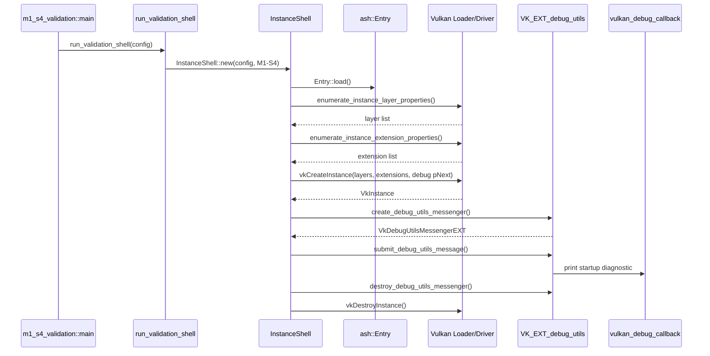

# M1-S4 Vulkan Validation Logging 时序图

## 关键顺序

1. 先查询 layer/extension 是否存在，再决定是否启用 validation。
2. 创建 instance 时同时把 debug messenger create info 放入 `pNext`，覆盖 instance 创建期间的验证输出。
3. `VkDebugUtilsMessengerEXT` 是 instance child object，销毁顺序必须早于 `VkInstance`。

