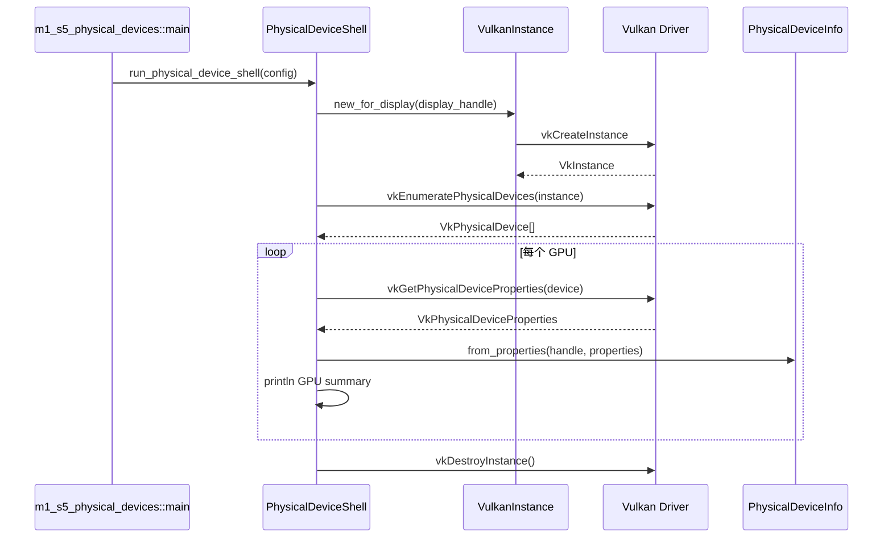

# M1-S5 Physical Device Enumeration 时序图

```mermaid
sequenceDiagram
    participant Main as m1_s5_physical_devices::main
    participant Shell as PhysicalDeviceShell
    participant Instance as VulkanInstance
    participant Vulkan as Vulkan Driver
    participant Info as PhysicalDeviceInfo

    Main->>Shell: run_physical_device_shell(config)
    Shell->>Instance: new_for_display(display_handle)
    Instance->>Vulkan: vkCreateInstance
    Vulkan-->>Instance: VkInstance
    Shell->>Vulkan: vkEnumeratePhysicalDevices(instance)
    Vulkan-->>Shell: VkPhysicalDevice[]
    loop 每个 GPU
        Shell->>Vulkan: vkGetPhysicalDeviceProperties(device)
        Vulkan-->>Shell: VkPhysicalDeviceProperties
        Shell->>Info: from_properties(handle, properties)
        Shell->>Shell: println GPU summary
    end
    Shell->>Vulkan: vkDestroyInstance()
```

## 关键顺序

1. 必须先创建 `VkInstance`，再枚举 physical devices。
2. `VkPhysicalDevice` 是 instance 枚举返回的 borrowed handle，不需要也不能手动销毁。
3. properties 查询是只读操作，不创建 GPU 资源。

