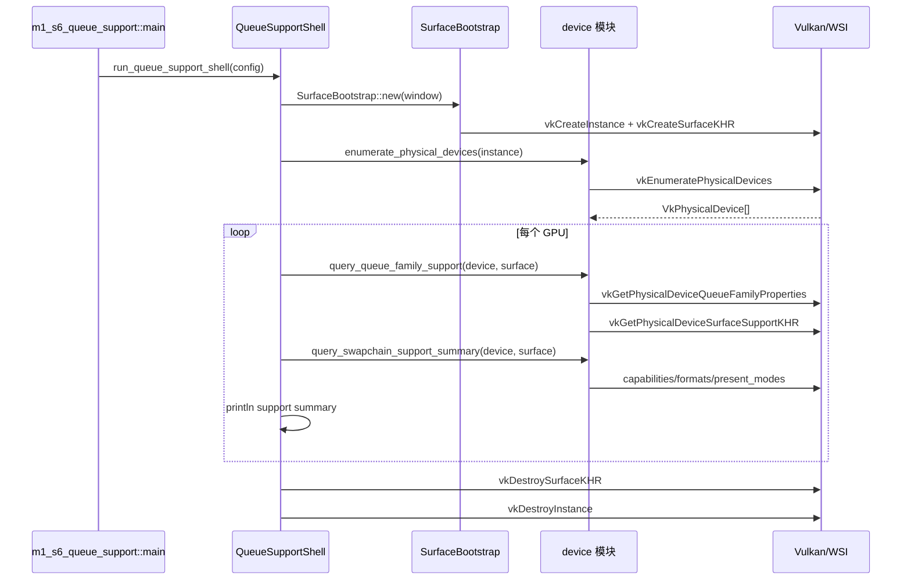

# M1-S6 Queue And Swapchain Support 时序图

## 关键顺序

1. present queue 支持必须针对具体 `VkSurfaceKHR` 查询。
2. graphics queue 支持来自 queue family flags，present 支持来自 WSI 扩展函数。
3. swapchain 可用性至少需要有 surface format 和 present mode。

