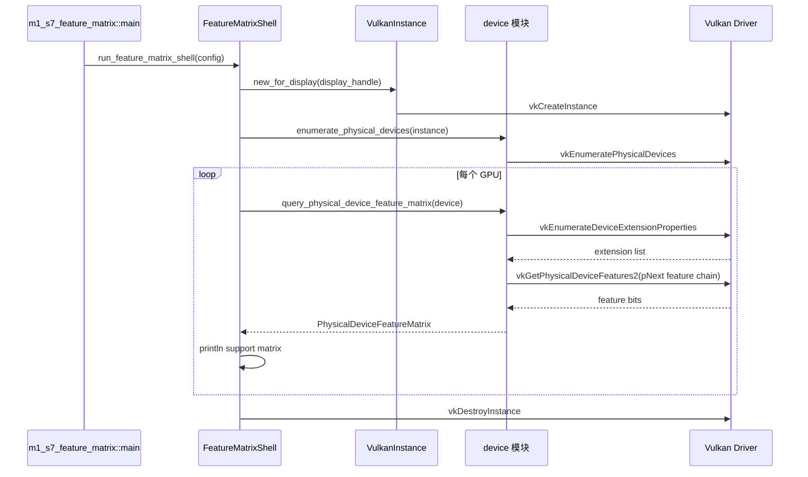

# M1-S7 Device Extension And Feature Matrix 时序图

## 关键顺序

1. device extension 支持必须逐个 physical device 查询。
2. 光追 feature bits 通过 `vkGetPhysicalDeviceFeatures2` 的 `pNext` 链查询。
3. 本任务只记录能力，不把能力写进 `VkDeviceCreateInfo`。

