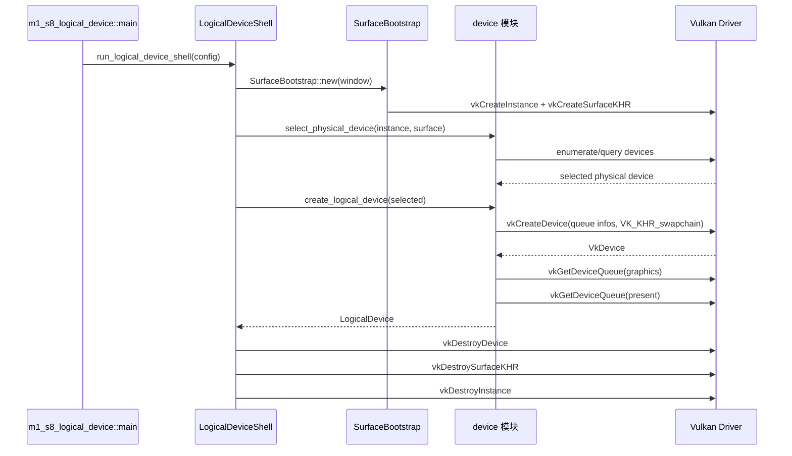

# M1-S8 Logical Device And Queues 时序图

## 关键顺序

1. 先选择同时满足 graphics/present/swapchain 的 physical device。
2. 创建 logical device 时必须启用 `VK_KHR_swapchain`。
3. device child objects 后续必须先于 `VkDevice` 销毁。

