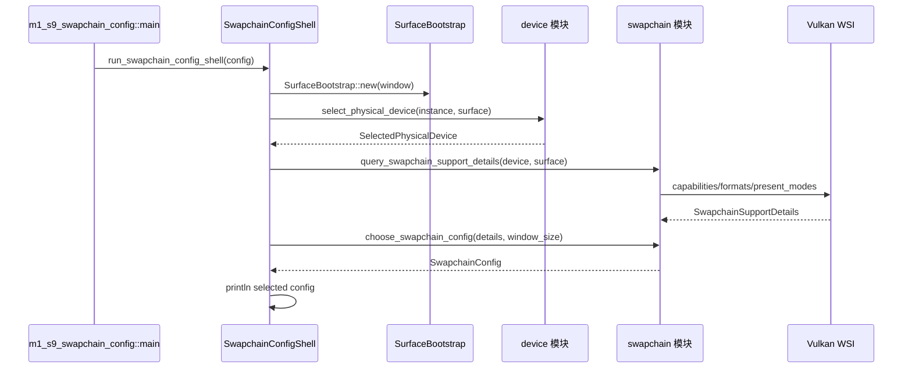

# M1-S9 Swapchain Configuration 时序图

## 关键顺序

1. 必须先有 selected physical device 和 surface，才能查询 swapchain support。
2. 参数选择是纯策略，不创建 Vulkan 对象。
3. S10 会使用这里的 `SwapchainConfig` 创建真正的 swapchain 和 image views。

